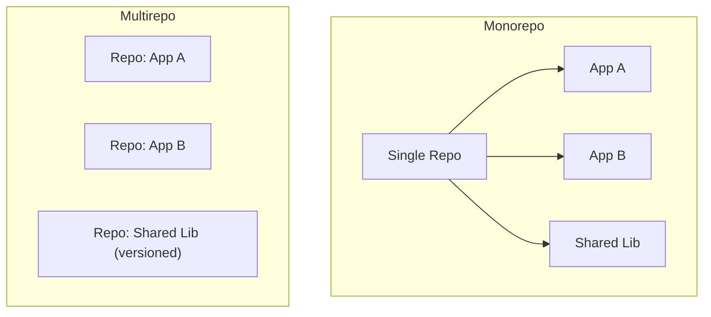

⬅ [Back to Index](../README.md)

# Monorepo / Multirepo

How do you organize many projects in Git — all in **one big repository (monorepo)** or **many separate repositories (multirepo)**? Each approach shapes how teams share code, coordinate changes, and scale tooling.

### 🎓 Professional (IT-Standard) Reference

| Concept | Layman View | Professional (IT-Standard) View + Example |
|---------|-------------|--------------------------------------------|
| Monorepo | Everything in one repo | A monorepo stores many projects/services in a single repository with shared history and tooling. It enables atomic cross-project changes. It centralizes dependencies and CI. It needs scalable tooling. *Example: Google's single company-wide repo.* |
| Multirepo | Many separate repos | A multirepo (polyrepo) keeps each project in its own repository. It gives teams independence and clear ownership. Cross-repo changes need coordination. It scales via versioned packages. *Example: each microservice in its own repo.* |
| Atomic change | One commit spanning projects | An atomic change updates multiple projects in a single commit/PR. It keeps interdependent changes consistent. It is natural in a monorepo. It is hard across multirepos. *Example: updating an API and its client together.* |

---

## 🧠 One Repo vs Many

**Explanation:** A **monorepo** puts every project side by side, so a shared library and its consumers live together and change atomically. A **multirepo** isolates each project, giving independence but requiring versioned packages and coordination for shared code.

---

## ⚖️ Trade-offs

| Aspect | Monorepo | Multirepo |
|--------|----------|-----------|
| Cross-project changes | ✅ Atomic, one PR | ❌ Multiple coordinated PRs |
| Code sharing | ✅ Direct | ⚠️ Via published packages |
| Team independence | ⚠️ Shared space | ✅ Fully isolated |
| Tooling needs | ❌ Heavy (scale required) | ✅ Simple per repo |
| Access control | ⚠️ Coarser | ✅ Per-repo |

---

## 🏛️ Simple Analogy

A monorepo is a **single large office building** — everyone under one roof, easy to walk over and collaborate, but you need serious facilities management. A multirepo is a **campus of separate buildings** — each team fully independent, but coordinating a shared project means walking between buildings.

---

## 🧩 Real-World Examples

- 🏢 **Google, Meta, Microsoft** run enormous monorepos with custom tooling.
- 🧩 **Microservice shops** often use multirepo for team autonomy.
- 📦 **Tools** like Nx, Turborepo, and Bazel make monorepos practical.

---

## 🧗 What You Gain: 50+ Years of Experience, Condensed

Work through this lesson and you absorb judgment that normally takes a career to earn. Each stage below is a level of mastery you unlock — by the end you carry the instincts of someone with 50+ years in the field:

| Stage | How you see repo structure | What you can do |
|-------|----------------------------|-----------------|
| 🌱 **Beginner** | "One repo per project, right?" | Work within either layout. |
| 🧭 **Learner** | Two competing models. | Explain the core trade-offs. |
| 🛠️ **Practitioner** | An organizational choice. | Operate CI and sharing in each. |
| 🚀 **Advanced** | A tooling and scale problem. | Set up build tooling for monorepos. |
| 🏛️ **Veteran** | A company-shaping decision. | Choose and evolve structure org-wide. |

---

## 🔬 Deep Dive — Advanced & Expert Insights

- **The choice is organizational, not just technical:** it shapes ownership, release cadence, and how teams depend on each other — pick for your org, not the hype.
- **Monorepos need real tooling:** naive CI that rebuilds everything on every commit doesn't scale — use affected-graph tools (Nx, Bazel, Turborepo) to build only what changed.
- **Multirepos shift complexity to versioning:** shared code becomes published, versioned packages, so you trade merge coordination for dependency management.
- **Sparse/partial clone:** Git features like partial clone and sparse-checkout make huge monorepos usable without downloading everything.
- **CODEOWNERS is critical in monorepos:** with everyone in one repo, path-based ownership keeps reviews routed and access sane.

> 🏛️ **Veteran habit:** don't cargo-cult Google's monorepo or Netflix's multirepo — match structure to your team's size, coupling, and tooling budget.

---

## ✅ Key Takeaways

- **Monorepo**: many projects, one repo — atomic changes, heavy tooling.
- **Multirepo**: many repos — team independence, versioned sharing.
- The decision is **organizational** as much as technical.
- Monorepos require **scalable, affected-graph build tooling**.

---

**Navigation:** [Next → Git Hooks](../06-Advanced-Git/git-hooks.md) | ⬅ [Back to Index](../README.md)
