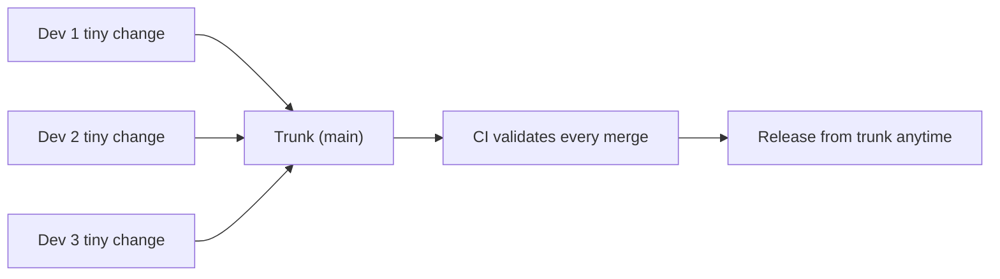

⬅ [Back to Index](../README.md)

# Trunk-Based Development

**Trunk-Based Development (TBD)** keeps everyone working on one shared branch — the trunk — with very small, very frequent merges. Combined with feature flags and strong CI, it enables the highest delivery velocity.

### 🎓 Professional (IT-Standard) Reference

| Concept | Layman View | Professional (IT-Standard) View + Example |
|---------|-------------|--------------------------------------------|
| Trunk | The single shared branch | The trunk (`main`) is the one branch all developers integrate into continuously.<br>It is always kept releasable.<br>Branches are tiny and short-lived.<br>It is the core of TBD.<br>*Example: everyone merging to `main` daily.* |
| Feature flag | An on/off switch for code | A feature flag conditionally enables code at runtime without a new deploy.<br>It lets unfinished work merge safely.<br>It decouples deploy from release.<br>It supports gradual rollout.<br>*Example: `if (flags.newCheckout) {...}`.* |
| Continuous integration | Merge and test constantly | Continuous integration (CI) means integrating and validating changes many times a day.<br>It catches conflicts and breakage early.<br>It requires fast, reliable tests.<br>It underpins TBD.<br>*Example: CI running on every small merge.* |

---

## 🧠 How Trunk-Based Works



**Explanation:** Instead of long feature branches, everyone commits **small changes straight to the trunk** (or via same-day PRs). CI validates each merge, and **feature flags** hide incomplete work — so the trunk stays releasable at all times.

---

## ⚡ Why Small and Frequent Wins

| Long-lived branches | Trunk-based |
|---------------------|-------------|
| Big, painful merges | Tiny, trivial merges |
| Conflicts pile up | Conflicts caught instantly |
| Integration delayed | Continuous integration |
| Risky "big bang" merges | Steady, low-risk flow |

---

## 🏛️ Simple Analogy

Trunk-based is like **everyone adding to one shared document in small edits all day**, with autosave and spellcheck (CI) running constantly. Because changes are tiny and frequent, they never collide badly — unlike emailing giant drafts back and forth once a week.

---

## 🧪 Trunk-Based in Practice

```bash
# Short-lived branch, merged same day
git switch -c small-fix main
# ...one small change...
git push -u origin small-fix
gh pr create --base main && gh pr merge --squash

# Hide unfinished work behind a flag instead of a long branch
# if (featureFlags.newUI) { renderNewUI(); }
```

---

## 🧩 Real-World Examples

- 🏢 **Google and Facebook** famously use trunk-based at massive scale.
- 🚀 **High-velocity SaaS** teams deploy from trunk many times a day.
- 🎛️ **Feature-flag platforms** (LaunchDarkly, etc.) make it practical.

---

## 🧗 What You Gain: 50+ Years of Experience, Condensed

Work through this lesson and you absorb judgment that normally takes a career to earn. Each stage below is a level of mastery you unlock — by the end you carry the instincts of someone with 50+ years in the field:

| Stage | How you see trunk-based | What you can do |
|-------|-------------------------|-----------------|
| 🌱 **Beginner** | "Everyone on one branch?!" | Understand the basic idea. |
| 🧭 **Learner** | Small, frequent merges. | Keep changes tiny and integrate daily. |
| 🛠️ **Practitioner** | Flags decouple deploy from release. | Ship dark code behind flags. |
| 🚀 **Advanced** | A CI-dependent discipline. | Sustain a releasable trunk under load. |
| 🏛️ **Veteran** | A scaling strategy. | Roll it out with tests and flags org-wide. |

---

## 🔬 Deep Dive — Advanced & Expert Insights

- **It's a discipline, not just a branch rule:** trunk-based *requires* fast tests, feature flags, and a culture of small changes — without them it collapses.
- **Flags are essential but have a cost:** stale flags become tech debt; track and remove them once a feature is fully rolled out.
- **Branch by abstraction:** for big refactors, introduce an abstraction layer and migrate incrementally on the trunk rather than forking a long branch.
- **Scales the best:** monorepo giants use trunk-based because thousands of engineers can't manage thousands of long-lived branches.
- **CI must be fast and trustworthy:** if the build is slow or flaky, developers stop integrating frequently and the model breaks.

> 🏛️ **Veteran habit:** invest in test speed and flag hygiene first. Trunk-based rewards teams that treat CI and flags as first-class infrastructure.

---

## ✅ Key Takeaways

- **TBD** integrates everyone into one **trunk** with tiny, frequent merges.
- **Feature flags** hide unfinished work and decouple deploy from release.
- It **depends on fast, reliable CI** and small changes.
- It **scales best** for large, high-velocity teams and monorepos.

---

**Navigation:** [Next → Monorepo / Multirepo](monorepo-multirepo.md) | ⬅ [Back to Index](../README.md)
