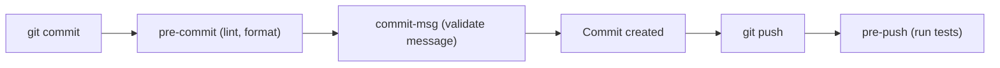

⬅ [Back to Index](../README.md)

# Git Hooks

**Git hooks** are scripts Git runs automatically at key moments — before a commit, before a push, after a merge. They let you enforce quality (linting, tests, message rules) without relying on anyone to remember.

### 🎓 Professional (IT-Standard) Reference

| Concept | Layman View | Professional (IT-Standard) View + Example |
|---------|-------------|--------------------------------------------|
| Client-side hook | A local automation trigger | A client-side hook runs on a developer's machine at events like commit or push.<br>It can lint, test, or validate messages.<br>It is not shared automatically by clone.<br>Tools distribute them to the team.<br>*Example: `pre-commit` running a linter.* |
| Server-side hook | A gate on the server | A server-side hook runs on the remote when refs are received.<br>It can reject non-compliant pushes.<br>It enforces policy centrally.<br>It cannot be bypassed by clients.<br>*Example: `pre-receive` rejecting large files.* |
| Hook manager | Shared, versioned hooks | A hook manager installs and versions hooks across a team from repo config.<br>It solves the "hooks aren't cloned" problem.<br>It standardizes checks.<br>It runs configured tools per event.<br>*Example: `pre-commit` framework or Husky.* |

---

## 🧠 When Hooks Fire



**Explanation:** Hooks slot into Git's lifecycle. **`pre-commit`** can lint and format before a commit is created, **`commit-msg`** can enforce message conventions, and **`pre-push`** can run tests before code leaves your machine — catching problems early and locally.

---

## 🪝 Common Hooks

| Hook | Fires | Typical use |
|------|-------|-------------|
| `pre-commit` | Before commit | Lint, format, block secrets |
| `commit-msg` | On message | Enforce Conventional Commits |
| `pre-push` | Before push | Run tests |
| `pre-receive` | On server receive | Reject bad pushes centrally |
| `post-merge` | After merge | Reinstall dependencies |

---

## 🏛️ Simple Analogy

Git hooks are like **automatic quality checkpoints on an assembly line**. Before a part moves to the next station (commit/push), a sensor inspects it. Faulty parts are stopped right there — nobody has to remember to check manually.

---

## 🧪 Writing a Hook

```bash
# .git/hooks/pre-commit  (make it executable)
#!/bin/sh
echo "Running linter..."
npm run lint || {
  echo "Lint failed — commit aborted."
  exit 1
}
```

```bash
# Shared, versioned hooks with the pre-commit framework
pip install pre-commit
pre-commit install        # installs the git hook
# configure checks in .pre-commit-config.yaml
```

---

## 🧩 Real-World Examples

- 🧹 **Auto-format** code so style is never debated in reviews.
- 🔐 **Block secrets** from ever being committed.
- ✅ **Enforce commit conventions** that power automated versioning.

---

## 🧗 What You Gain: 50+ Years of Experience, Condensed

Work through this lesson and you absorb judgment that normally takes a career to earn. Each stage below is a level of mastery you unlock — by the end you carry the instincts of someone with 50+ years in the field:

| Stage | How you see hooks | What you can do |
|-------|-------------------|-----------------|
| 🌱 **Beginner** | "Some scripts in `.git`." | Understand what hooks are. |
| 🧭 **Learner** | Automatic local checks. | Write a simple pre-commit hook. |
| 🛠️ **Practitioner** | A quality safety net. | Share hooks across a team. |
| 🚀 **Advanced** | Client + server enforcement. | Combine local and server-side gates. |
| 🏛️ **Veteran** | A policy automation layer. | Standardize hook policy org-wide. |

---

## 🔬 Deep Dive — Advanced & Expert Insights

- **Hooks aren't cloned:** `.git/hooks` doesn't travel with the repo — use a manager (pre-commit, Husky) or `core.hooksPath` to share them reliably.
- **Client hooks are advisory:** developers can bypass them with `--no-verify`, so critical rules also need server-side hooks or branch protection.
- **Keep them fast:** slow pre-commit hooks train people to skip them — run only quick checks locally and heavier ones in CI.
- **`core.hooksPath`** points Git at a version-controlled hooks directory, making team-wide hooks trivial to distribute.
- **Defense in depth:** the same rule (e.g. no secrets) belongs at commit time, in CI, and in server hooks — layers catch what any single one misses.

> 🏛️ **Veteran habit:** use local hooks for fast feedback and *fun*, but enforce anything that truly matters server-side — clients can always be bypassed.

---

## ✅ Key Takeaways

- **Hooks** run scripts at Git lifecycle events (commit, push, receive).
- Client hooks give **fast local feedback**; server hooks **enforce policy**.
- Hooks aren't cloned — **share them with a manager** or `core.hooksPath`.
- Keep them **fast** and enforce critical rules **server-side too**.

---

**Navigation:** [Next → Submodules](submodules.md) | ⬅ [Back to Index](../README.md)
