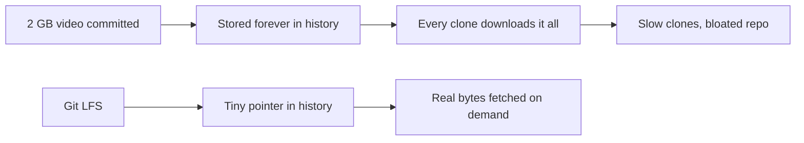

⬅ [Back to Index](../README.md)

# Git LFS

**Git Large File Storage (LFS)** replaces big binary files — images, videos, datasets, models — with lightweight text pointers, storing the real content on a separate server. It keeps repositories fast and clones small.

### 🎓 Professional (IT-Standard) Reference

| Concept | Layman View | Professional (IT-Standard) View + Example |
|---------|-------------|--------------------------------------------|
| Git LFS | Big-file handler for Git | Git LFS is an extension that stores large files outside the main repo, leaving a small pointer behind.<br>It keeps history lightweight.<br>It fetches real content on checkout.<br>It targets binary assets.<br>*Example: tracking `*.psd` with LFS.* |
| Pointer file | A stand-in for the real file | An LFS pointer is a tiny text file storing the object's hash and size instead of the binary.<br>It lives in Git history.<br>The real bytes live on the LFS server.<br>It keeps clones fast.<br>*Example: a 130-byte pointer for a 2 GB video.* |
| Tracking pattern | Which files use LFS | A tracking pattern in `.gitattributes` tells Git which paths LFS should manage.<br>It is committed to the repo.<br>Matching files are stored via LFS.<br>It is set with `git lfs track`.<br>*Example: `*.mp4 filter=lfs`.* |

---

## 🧠 Why Regular Git Struggles With Big Files



**Explanation:** Git stores **every version of every file forever**, so committing large binaries permanently bloats the repo and slows every clone. **LFS** keeps only a small pointer in history and downloads the actual bytes on demand — history stays lean.

---

## 📦 What Belongs in LFS

| Good for LFS | Keep in normal Git |
|--------------|--------------------|
| Videos, audio, images | Source code |
| Datasets, ML models | Config and text files |
| Design files (PSD, AI) | Documentation |
| Compiled binaries/assets | Small assets |

---

## 🏛️ Simple Analogy

Git LFS is like a **coat check at a theater**. Instead of dragging a bulky coat (huge file) into your seat and everyone else's, you leave it at the counter and carry a small ticket (pointer). You reclaim the coat only when you actually need it.

---

## 🧪 Using Git LFS

```bash
# One-time install
git lfs install

# Track a file type (writes to .gitattributes)
git lfs track "*.mp4"
git add .gitattributes

# Commit as usual — LFS handles the big file
git add trailer.mp4
git commit -m "Add trailer video"
git push

# See what LFS is managing
git lfs ls-files
```

---

## 🧩 Real-World Examples

- 🎮 **Game dev** stores art, audio, and models in LFS.
- 🤖 **ML teams** version large datasets and model weights.
- 🎨 **Design-heavy repos** keep PSD/AI files manageable.

---

## 🧗 What You Gain: 50+ Years of Experience, Condensed

Work through this lesson and you absorb judgment that normally takes a career to earn. Each stage below is a level of mastery you unlock — by the end you carry the instincts of someone with 50+ years in the field:

| Stage | How you see Git LFS | What you can do |
|-------|---------------------|-----------------|
| 🌱 **Beginner** | "A plugin for big files." | Install LFS and track a file. |
| 🧭 **Learner** | Pointers vs real content. | Explain why LFS keeps repos small. |
| 🛠️ **Practitioner** | An asset-management tool. | Configure tracking and CI for LFS. |
| 🚀 **Advanced** | A storage/bandwidth trade-off. | Manage quotas, migration, and pruning. |
| 🏛️ **Veteran** | A repo-health strategy. | Set LFS policy and alternatives org-wide. |

---

## 🔬 Deep Dive — Advanced & Expert Insights

- **Add LFS before the big file, not after:** a binary committed normally stays in history forever — you must rewrite history (`git lfs migrate`) to remove the bloat later.
- **Watch quotas and bandwidth:** hosted LFS has storage and bandwidth limits; CI that clones fully can burn through them fast — use `GIT_LFS_SKIP_SMUDGE` where bytes aren't needed.
- **CI needs LFS awareness:** checkouts must pull LFS objects (or skip them deliberately) or you'll get pointer files instead of real content.
- **Alternatives for huge data:** for very large datasets, purpose-built tools (DVC, artifact stores) may beat LFS — LFS is best for moderate binary assets alongside code.
- **`.gitattributes` is the contract:** it must be committed and consistent, or teammates will commit big files outside LFS by accident.

> 🏛️ **Veteran habit:** decide your binary strategy *before* the first large asset lands — cleaning bloated history afterward is painful and disruptive.

---

## ✅ Key Takeaways

- **Git LFS** stores large binaries outside history, leaving a **pointer**.
- It keeps **clones fast** and repos lean.
- Configure tracking in **`.gitattributes`** and set it up **before** committing big files.
- Mind **quotas, bandwidth, and CI** LFS handling.

---

**Navigation:** [Next → Repository Security](repository-security.md) | ⬅ [Back to Index](../README.md)
