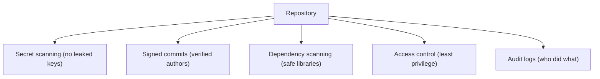

⬅ [Back to Index](../README.md)

# Repository Security

**Repository security** protects your code, history, and supply chain — keeping secrets out, verifying who committed what, and catching vulnerabilities early. A leaked key or tampered commit can be far more costly than a bug.

### 🎓 Professional (IT-Standard) Reference

| Concept | Layman View | Professional (IT-Standard) View + Example |
|---------|-------------|--------------------------------------------|
| Secret scanning | Catch leaked keys | Secret scanning detects credentials and tokens committed to a repo.<br>It alerts or blocks on detection.<br>It covers history and new pushes.<br>Leaked secrets must be rotated.<br>*Example: flagging an AWS key in a commit.* |
| Commit signing | Prove who committed | Commit signing uses GPG or SSH keys to cryptographically verify a commit's author.<br>It shows a "Verified" badge.<br>It prevents author spoofing.<br>It can be required by policy.<br>*Example: `git commit -S` with a signing key.* |
| Dependency scanning | Find vulnerable libraries | Dependency scanning checks used packages against known vulnerability databases.<br>It flags risky versions.<br>It can auto-open update PRs.<br>It secures the supply chain.<br>*Example: Dependabot alerts and PRs.* |

---

## 🧠 Layers of Repo Security



**Explanation:** Security isn't one setting — it's **layers**: keep secrets out, verify commit authorship, scan dependencies, grant least-privilege access, and keep audit trails. Each layer catches threats the others miss.

---

## 🛡️ Security Practices

| Practice | Protects against |
|----------|------------------|
| Secret scanning + `.gitignore` | Leaked credentials |
| Signed commits | Author spoofing / tampering |
| Dependency scanning | Vulnerable libraries |
| Least-privilege access | Over-broad permissions |
| Branch protection | Unreviewed/forced changes |
| 2FA on accounts | Account takeover |

---

## 🏛️ Simple Analogy

Repository security is like protecting a **bank**, not just locking one door. You screen what comes in (secret scanning), verify every employee's badge (signed commits), inspect supplier deliveries (dependency scanning), limit who can enter the vault (access control), and keep camera footage (audit logs).

---

## 🧪 Hardening a Repo

```bash
# Sign your commits
git config user.signingkey <KEY_ID>
git config commit.gpgsign true
git commit -S -m "Signed commit"

# Never commit secrets — keep them out
printf ".env\n*.pem\n*.key\n" >> .gitignore

# If a secret leaks: rotate it immediately, then purge history
# git filter-repo --path secret.txt --invert-paths
```

---

## 🧩 Real-World Examples

- 🔑 **Leaked API keys** are auto-detected and the owner alerted.
- ✅ **"Verified" badges** confirm commits came from trusted signers.
- 🤖 **Dependabot** opens PRs to patch vulnerable dependencies.

---

## 🧗 What You Gain: 50+ Years of Experience, Condensed

Work through this lesson and you absorb judgment that normally takes a career to earn. Each stage below is a level of mastery you unlock — by the end you carry the instincts of someone with 50+ years in the field:

| Stage | How you see repo security | What you can do |
|-------|---------------------------|-----------------|
| 🌱 **Beginner** | "Just don't share passwords." | Keep secrets out of commits. |
| 🧭 **Learner** | Several protective features. | Enable scanning and 2FA. |
| 🛠️ **Practitioner** | A layered defense. | Sign commits and scan dependencies. |
| 🚀 **Advanced** | A supply-chain concern. | Harden CI, tokens, and access. |
| 🏛️ **Veteran** | An org-wide risk posture. | Define and enforce security policy at scale. |

---

## 🔬 Deep Dive — Advanced & Expert Insights

- **A leaked secret is compromised forever:** rotating it is the *only* real fix — purging history helps, but assume anything pushed public was captured instantly.
- **Sign for provenance:** in supply-chain-sensitive environments, required signed commits plus verified tags prove exactly who produced what.
- **Least privilege for tokens too:** CI tokens and PATs should be scoped narrowly and short-lived — broad, long-lived tokens are a top breach vector.
- **Shift security left:** catch issues at commit time (hooks), in PRs (scanning), and in CI — the earlier a leak or vuln is caught, the cheaper it is.
- **Audit and review access regularly:** stale collaborators, over-privileged apps, and forgotten deploy keys accumulate risk — prune them on a schedule.

> 🏛️ **Veteran habit:** assume breach. Design so that a single leaked key or compromised account is contained, detected, and quickly revocable.

---

## ✅ Key Takeaways

- Security is **layered**: secrets, signing, dependencies, access, audit.
- **Never commit secrets**; if leaked, **rotate immediately**.
- **Sign commits** for verified authorship and integrity.
- Use **least-privilege tokens, 2FA, and dependency scanning**.

---

**Navigation:** [Next → Industry Best Practices](../07-Best-Practices/industry-best-practices.md) | ⬅ [Back to Index](../README.md)
