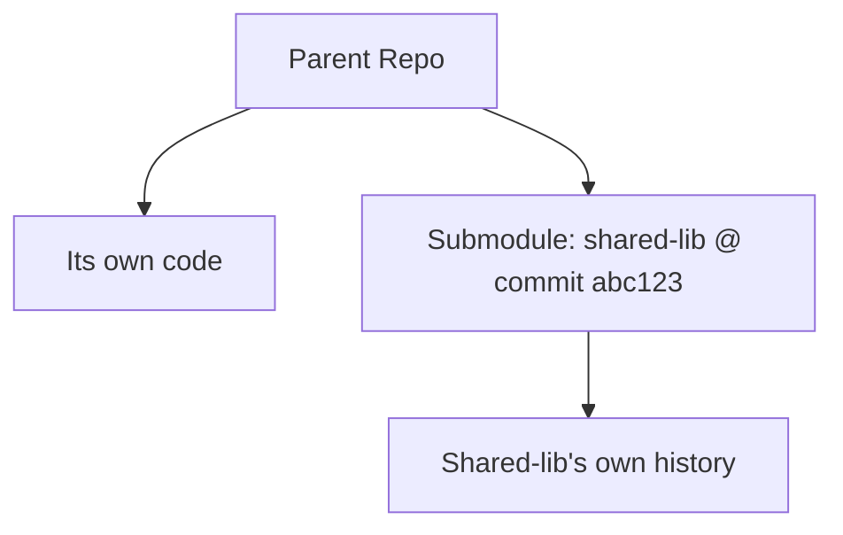

⬅ [Back to Index](../README.md)

# Submodules

**Git submodules** let you embed one repository inside another at a pinned commit. They're how you include a shared library or third-party project while keeping its history separate and its version controlled.

### 🎓 Professional (IT-Standard) Reference

| Concept | Layman View | Professional (IT-Standard) View + Example |
|---------|-------------|--------------------------------------------|
| Submodule | A repo nested in a repo | A submodule is a reference to a specific commit of an external repository embedded in a parent repo.<br>The parent records the exact commit, not the files.<br>Each submodule keeps its own history.<br>It enables shared, pinned dependencies.<br>*Example: a shared UI library as a submodule.* |
| Pinned commit | A locked version | A submodule points at one commit, so the parent always gets that exact version until updated.<br>It ensures reproducible builds.<br>Updating requires an explicit commit.<br>It avoids surprise upstream changes.<br>*Example: parent pinned to lib commit `abc123`.* |
| .gitmodules | The submodule registry | The `.gitmodules` file records each submodule's path and URL.<br>It is committed to the parent repo.<br>It lets others initialize submodules.<br>It maps names to remotes.<br>*Example: listing `libs/ui` and its URL.* |

---

## 🧠 A Repo Inside a Repo



**Explanation:** The parent repo stores its own files plus a **pointer** to an exact commit of the submodule — not the submodule's files. The submodule keeps its own independent history. Cloning the parent needs an extra step to fetch the submodule's contents.

---

## 🧰 Core Submodule Commands

| Command | What it does |
|---------|--------------|
| `git submodule add <url> <path>` | Add a submodule |
| `git clone --recurse-submodules` | Clone parent + submodules |
| `git submodule update --init --recursive` | Fetch submodule contents |
| `git submodule update --remote` | Move pointer to latest upstream |

---

## 🏛️ Simple Analogy

A submodule is like **citing a specific edition of a book** in your paper. You don't copy the whole book into yours — you reference exactly *which edition and page*. If a newer edition appears, your citation stays put until you deliberately update it.

---

## 🧪 Working With Submodules

```bash
# Add a shared library as a submodule
git submodule add https://github.com/org/shared-lib.git libs/shared

# Clone a project that uses submodules
git clone --recurse-submodules https://github.com/org/app.git

# Or, after a normal clone:
git submodule update --init --recursive

# Update the submodule to the latest upstream commit
git submodule update --remote libs/shared
git commit -am "Bump shared-lib"
```

---

## 🧩 Real-World Examples

- 📚 **Shared internal libraries** pinned across multiple apps.
- 🔌 **Third-party dependencies** vendored at a known-good commit.
- 🧩 **Plugin systems** composing several repos into one build.

---

## 🧗 What You Gain: 50+ Years of Experience, Condensed

Work through this lesson and you absorb judgment that normally takes a career to earn. Each stage below is a level of mastery you unlock — by the end you carry the instincts of someone with 50+ years in the field:

| Stage | How you see submodules | What you can do |
|-------|------------------------|-----------------|
| 🌱 **Beginner** | "A folder that's also a repo?" | Clone a project with submodules. |
| 🧭 **Learner** | A pinned external repo. | Add and initialize submodules. |
| 🛠️ **Practitioner** | A shared-code mechanism. | Update and commit submodule bumps. |
| 🚀 **Advanced** | A reproducibility tool. | Manage nested submodules and CI. |
| 🏛️ **Veteran** | One option among alternatives. | Choose submodules vs packages wisely. |

---

## 🔬 Deep Dive — Advanced & Expert Insights

- **Submodules pin commits, not branches:** you get exactly the referenced commit — great for reproducibility, but updates are a deliberate, committed action.
- **The classic gotcha:** people clone without `--recurse-submodules`, get empty folders, and are confused — document the init step or automate it in CI.
- **They add friction:** every contributor must understand the extra workflow; for pure code sharing, versioned packages are often simpler.
- **Alternatives exist:** package managers, `git subtree`, and monorepos each solve "shared code" differently — submodules shine when you need separate history *and* exact pinning.
- **CI must init submodules:** pipelines need `submodules: recursive` (or the update command) or builds fail with missing files.

> 🏛️ **Veteran habit:** reach for submodules only when you need independent history plus exact pinning — otherwise a package registry is usually less painful.

---

## ✅ Key Takeaways

- A **submodule** embeds another repo at a **pinned commit**.
- The parent stores a **pointer**, not the submodule's files.
- Clone with **`--recurse-submodules`** or run `submodule update --init`.
- Consider **packages or subtree** when full submodule complexity isn't needed.

---

**Navigation:** [Next → Git LFS](git-lfs.md) | ⬅ [Back to Index](../README.md)
