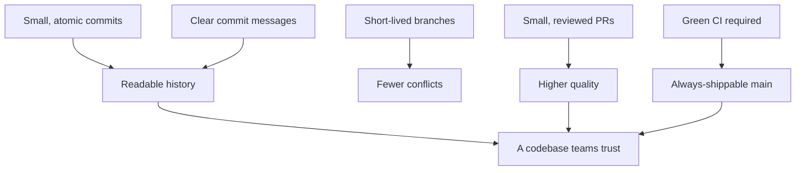

⬅ [Back to Index](../README.md)

# Industry Best Practices

This lesson distills the whole track into the habits that separate messy repositories from professional ones. None are hard on their own — together they make a codebase a joy to work in and safe to ship from.

### 🎓 Professional (IT-Standard) Reference

| Concept | Layman View | Professional (IT-Standard) View + Example |
|---------|-------------|--------------------------------------------|
| Atomic commit | One change per commit | An atomic commit captures a single logical change that builds and passes tests on its own.<br>It is easy to review and revert.<br>It keeps history readable.<br>It isolates cause and effect.<br>*Example: "Fix null check in login" as one commit.* |
| Conventional Commits | A message format | Conventional Commits is a structured commit-message convention (`type: description`).<br>It enables automated versioning and changelogs.<br>It communicates intent clearly.<br>It is machine- and human-readable.<br>*Example: `feat: add password reset`.* |
| Definition of done | Agreed "finished" bar | A definition of done lists the criteria a change must meet to be complete (tests, review, docs).<br>It aligns the team.<br>It prevents half-finished merges.<br>It travels with the workflow.<br>*Example: "tests pass, reviewed, docs updated".* |

---

## 🧠 The Habits That Compound



**Explanation:** No single habit is dramatic, but together they compound. Small commits and clear messages make history readable; short branches and small PRs cut conflicts and raise quality; required CI keeps `main` shippable — and the result is a repo the whole team *trusts*.

---

## ✅ The Best-Practice Checklist

| Area | Do this |
|------|---------|
| **Commits** | Small, atomic, one logical change each |
| **Messages** | Imperative mood; explain *why*, e.g. `fix: handle empty cart` |
| **Branches** | Short-lived, descriptively named, deleted after merge |
| **Pull Requests** | Small, focused, self-reviewed before requesting review |
| **Reviews** | Kind, specific, reasoned; automate style checks |
| **main** | Always deployable; protected with checks + reviews |
| **Secrets** | Never committed; scanned and rotated if leaked |
| **.gitignore** | Set up before the first commit |
| **Releases** | Tagged, versioned (SemVer), documented, reversible |

---

## 🖊️ Writing Great Commit Messages

```text
feat: add password reset flow

Users can now request a reset link by email. Tokens expire
after 30 minutes and are single-use.

Closes #212
```

- **Subject:** imperative, under ~50 chars (`add`, not `added`).
- **Body:** explain *why*, not just *what* — the diff already shows what.
- **Footer:** link issues (`Closes #212`) and note breaking changes.

---

## 🏛️ Simple Analogy

Best practices are like **good kitchen habits**. Clean as you go (small commits), label your containers (clear messages), don't leave dishes for a week (short branches), and taste before serving (review + CI). None is heroic, but a cook who does them consistently runs a kitchen everyone wants to work in.

---

## 🧩 Real-World Examples

- 🧾 **Conventional Commits** auto-generate changelogs and version bumps.
- 🔁 **Small PRs merged daily** keep large teams conflict-free.
- 🛡️ **Protected `main` + required CI** means production is always shippable.

---

## 🧗 What You Gain: 50+ Years of Experience, Condensed

Work through this lesson and you absorb judgment that normally takes a career to earn. Each stage below is a level of mastery you unlock — by the end you carry the instincts of someone with 50+ years in the field:

| Stage | How you see best practices | What you can do |
|-------|----------------------------|-----------------|
| 🌱 **Beginner** | "Rules I'm told to follow." | Write commits and open PRs. |
| 🧭 **Learner** | Habits that reduce pain. | Keep commits and branches small. |
| 🛠️ **Practitioner** | A consistent daily discipline. | Maintain clean history and green CI. |
| 🚀 **Advanced** | A quality system. | Automate conventions and gates. |
| 🏛️ **Veteran** | A culture to cultivate. | Set standards and mentor a whole team. |

---

## 🔬 Deep Dive — Advanced & Expert Insights

- **Consistency beats brilliance:** a team that always does the basics well outperforms one that occasionally does something clever. Standardize and automate the basics.
- **Automate the rules:** hooks, CI, branch protection, and commit linters enforce standards without nagging — humans forget, automation doesn't.
- **History is documentation:** a clean, well-messaged history is the cheapest, most durable documentation you'll ever write — invest in it.
- **Optimize for the reader:** every commit and PR is read far more often than written. Make review and archaeology easy for your future teammates.
- **Culture over tooling:** the best tools fail without a team that values small changes, honest reviews, and a shippable mainline — lead by example.

> 🏛️ **Veteran habit:** make the right thing the easy thing. When good practices are automated defaults, quality stops depending on anyone's memory.

---

## ✅ Key Takeaways

- Keep commits **small and atomic** with **clear, why-focused messages**.
- Use **short-lived branches** and **small, reviewed PRs**.
- Keep **`main` always deployable**, protected by **reviews + CI**.
- **Automate** conventions; **never commit secrets**; version releases with **SemVer**.

---

**Navigation:** [Next → Git Cheat Sheet](../08-Cheat-Sheets/git-cheatsheet.md) | ⬅ [Back to Index](../README.md)
